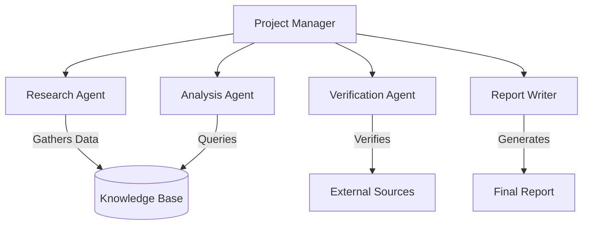

# 🕵️‍♂️ Agentic Research Assistant

An autonomous multi-agent system that conducts deep, structured research and synthesizes citable reports on complex topics using CrewAI, LangChain, and RAG (Retrieval-Augmented Generation).


## 🌟 Features

- **Multi-Agent Collaboration**: Hierarchical team of specialized AI agents working together
- **Deep Research**: Automated web search and information gathering using Tavily API
- **Knowledge Base**: Vector database (ChromaDB) for storing and retrieving research findings
- **Fact Verification**: Dedicated agent for citation checking and source validation
- **Professional Reports**: Automatically generated, well-structured Markdown reports
- **Interactive UI**: Beautiful Streamlit interface with real-time progress tracking
- **Flexible LLM Support**: Works with Groq (Llama, Mixtral) and OpenAI (GPT-4) models

## 🏗️ Architecture

### Agent Hierarchy



### Agents

1. **Project Manager** - Orchestrates the entire research workflow
2. **Research Agent** - Conducts web searches and populates the knowledge base
3. **Analysis Agent** - Synthesizes information into structured insights
4. **Verification Agent** - Validates facts and ensures source accuracy
5. **Report Writer** - Creates polished, professional research reports

## 🚀 Quick Start

### Prerequisites

- Python 3.11 or higher
- API Keys:
  - [Groq API Key](https://console.groq.com/) (free tier available)
  - [Tavily API Key](https://tavily.com/) (for web search)
  - [OpenAI API Key](https://platform.openai.com/) (optional)

### Installation

1. **Clone the repository**
   ```bash
   git clone <repository-url>
   cd Agentic-Research-Assistant
   ```

2. **Create virtual environment**
   ```bash
   python -m venv .venv
   .venv\Scripts\activate  # Windows
   # or
   source .venv/bin/activate  # Linux/Mac
   ```

3. **Install dependencies**
   ```bash
   pip install -r requirements.txt
   ```
   
   Or using `uv` (faster):
   ```bash
   uv pip install -r requirements.txt
   ```

4. **Configure environment variables**
   
   Create a `.env` file in the project root:
   ```env
   GROQ_API_KEY=your_groq_api_key_here
   TAVILY_API_KEY=your_tavily_api_key_here
   LLM_MODEL=groq/llama-3.1-8b-instant
   
   # Optional: for OpenAI models
   OPENAI_API_KEY=your_openai_api_key_here
   ```

### Running the Application

#### Option 1: Streamlit Web UI (Recommended)

```bash
.venv\Scripts\streamlit.exe run app.py
```

Then open your browser to `http://localhost:8501`

#### Option 2: Command Line

```bash
python run_crew.py
```

## 📖 Usage Guide

### Using the Streamlit Interface

1. **Start the app**: Run `streamlit run app.py`
2. **Configure settings** in the sidebar:
   - Select your preferred LLM model
   - Choose whether to clear the knowledge base before each run
3. **Enter a research topic**: e.g., "The Future of Quantum Computing"
4. **Click "Start Research"** and watch the agents work!
5. **View results**:
   - Real-time progress tracking
   - Agent activity logs (expandable)
   - Final report displayed in Markdown
   - Download button for the report

### Example Topics

- "The impact of AI on healthcare in 2024"
- "Sustainable energy solutions for urban areas"
- "The future of quantum computing"
- "Blockchain technology in supply chain management"

## 🛠️ Project Structure

```
Agentic-Research-Assistant/
├── app.py                 # Streamlit web interface
├── run_crew.py           # CLI interface
├── main.py               # Alternative entry point
├── requirements.txt      # Python dependencies
├── .env                  # Environment variables (create this)
├── src/
│   ├── agents.py         # Agent definitions
│   ├── tasks.py          # Task definitions
│   └── tools.py          # Custom tools and utilities
├── chroma_db/            # Vector database storage
└── verify_setup.py       # Setup verification script
```

## 🔧 Configuration

### Supported Models

**Groq (Free Tier Available)**:
- `groq/llama-3.1-8b-instant` (default, fastest)
- `groq/llama3-70b-8192` (more capable)
- `groq/mixtral-8x7b-32768` (best quality)

**OpenAI (Paid)**:
- `openai/gpt-4o`
- `openai/gpt-4-turbo`

### Environment Variables

| Variable | Description | Required |
|----------|-------------|----------|
| `GROQ_API_KEY` | Groq API key for LLM access | Yes (if using Groq) |
| `TAVILY_API_KEY` | Tavily API key for web search | Yes |
| `OPENAI_API_KEY` | OpenAI API key | No (only if using GPT models) |
| `LLM_MODEL` | Default model to use | No (defaults to llama-3.1-8b-instant) |

## 🧪 Testing

Verify your setup:

```bash
python verify_setup.py
```

Expected output:
```
Initializing tools...
Tools initialized successfully.
Initializing agents...
Project Manager initialized: Senior Project Manager
Verification successful!
```

## 📝 Output

Research reports are saved as Markdown files with timestamps:
- Format: `report_<topic>_<timestamp>.md`
- Example: `report_Quantum_Computing_20241129-183045.md`

## 🐛 Troubleshooting

### Common Issues

**1. ModuleNotFoundError**
```bash
# Make sure you're using the virtual environment
.venv\Scripts\activate
pip install -r requirements.txt
```

**2. Rate Limit Errors (Groq)**
- Wait 30 seconds and retry
- Switch to a different Groq model
- Upgrade to Groq Dev Tier

**3. Streamlit Not Displaying**
- Ensure you're running with the venv's streamlit: `.venv\Scripts\streamlit.exe run app.py`
- Check that port 8501 is not blocked

**4. No Output in Streamlit**
- Check the "Agent Activity Logs" expandable section
- Some logs may still appear in the terminal

## 🤝 Contributing

Contributions are welcome! Please feel free to submit a Pull Request.

## 📄 License

This project is licensed under the MIT License.

## 🙏 Acknowledgments

- [CrewAI](https://github.com/joaomdmoura/crewAI) - Multi-agent orchestration framework
- [LangChain](https://github.com/langchain-ai/langchain) - LLM application framework
- [Streamlit](https://streamlit.io/) - Web interface framework
- [Groq](https://groq.com/) - Fast LLM inference
- [Tavily](https://tavily.com/) - AI-powered search API

## 📧 Support

For issues and questions, please open an issue on GitHub.

---

**Built with ❤️ using CrewAI, LangChain, and Streamlit**
